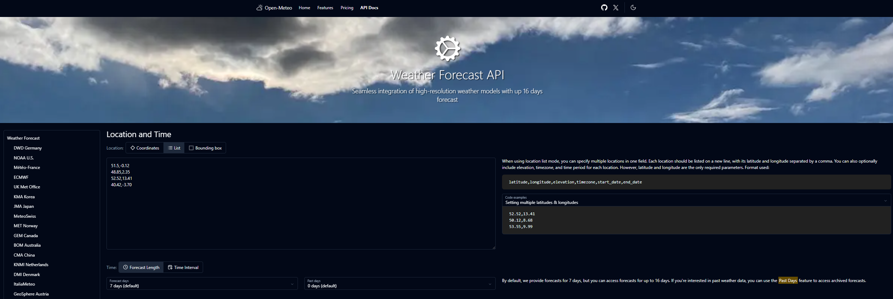
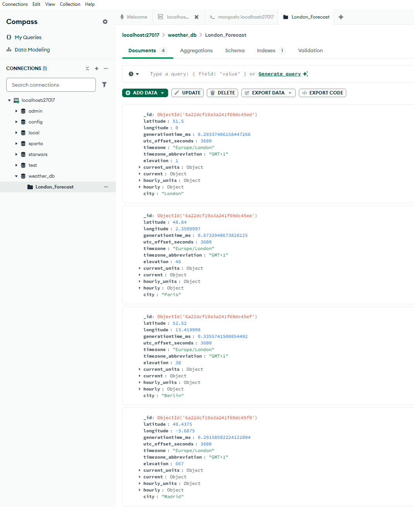

# Bash Spartans ETL Cloud Project

## Overview
A Python-based ETL pipeline that extracts live weather data from the Open Meteo API, stores it in MongoDB, exports it to JSON, and uploads it to AWS S3. Built collaboratively using GitHub branches.

## Pipeline
```
API -> Python -> MongoDB -> JSON -> S3
```

## Installations

```bash
pip install requests pymongo boto3 bson
```

| Package | What it does |
|---|---|
| `requests` | Fetches data from the Open Meteo API |
| `pymongo` | Connects to and interacts with MongoDB |
| `boto3` | AWS SDK (Software Development Kit) - uploads files to S3 |
| `bson` | Handles MongoDB's ObjectId when serializing to JSON |

## Process

### 1. Finding the API
We used the [Open Meteo API](https://open-meteo.com), this API returns live weather data in JSON format.

### 2. Fetching the Data
We started by fetching weather data for London and printing it in Python to verify the API was working.

```python
import requests

url = "https://api.open-meteo.com/v1/forecast?latitude=51.5&longitude=-0.12&hourly=temperature_2m,relative_humidity_2m,wind_speed_10m&current=temperature_2m,wind_speed_10m&timezone=Europe%2FLondon"

response = requests.get(url)
data = response.json()

print(data)
```

### 3. Fetching Multiple Cities


*The Open Meteo API showing our four city coordinates.*

Using the base URL we couldn't fetch data for multiple cities. Instead, we created a `for` loop that iterates through a `cities` list, building a dynamic URL for each city using a formated string:

```python
import requests

cities = [
    {"name": "London", "lat": 51.5, "lon": -0.12},
    {"name": "Paris", "lat": 48.85, "lon": 2.35},
    {"name": "Berlin", "lat": 52.52, "lon": 13.41},
    {"name": "Madrid", "lat": 40.42, "lon": -3.70}
]

for city in cities:
    url = f"https://api.open-meteo.com/v1/forecast?latitude={city['lat']}&longitude={city['lon']}&hourly=temperature_2m,relative_humidity_2m,wind_speed_10m&current=temperature_2m,wind_speed_10m&timezone=Europe%2FLondon"
    
    response = requests.get(url)
    data = response.json()
    data['city'] = city['name']
    
    print(city['name'], data['current'])
```

Each iteration fetches one city, adds the city name to the response, and prints the current weather. This gave us clean data for all four cities.

### 4. Storing Data in MongoDB

We connected to a local MongoDB instance and created a database called `weather_db` with a collection called `London_Forecast`.

We first tested with just London to verify the connection and document structure was working using this script:

```python
import requests 
from pymongo import MongoClient

client = MongoClient()
db = client["weather_db"]
collection = db["London_Forecast"]

url = "https://api.open-meteo.com/v1/forecast?latitude=51.5&longitude=-0.12&hourly=temperature_2m,relative_humidity_2m,wind_speed_10m&current=temperature_2m,wind_speed_10m&timezone=Europe%2FLondon"

response = requests.get(url)
data = response.json()
data['city'] = "London"

collection.insert_one(data)
print("Inserted London")
```

Once confirmed, we extended the script to fetch all four cities. Each city is appended to a `records` list and inserted the data into MongoDB using `insert_many()`:

```python
import requests 
from pymongo import MongoClient

client = MongoClient()
db = client["weather_db"]
collection = db["London_Forecast"]

cities = [
    {"name": "London", "lat": 51.5, "lon": -0.12},
    {"name": "Paris", "lat": 48.85, "lon": 2.35},
    {"name": "Berlin", "lat": 52.52, "lon": 13.41},
    {"name": "Madrid", "lat": 40.42, "lon": -3.70}
]

records = []

for city in cities:
    url = f"https://api.open-meteo.com/v1/forecast?latitude={city['lat']}&longitude={city['lon']}&hourly=temperature_2m,relative_humidity_2m,wind_speed_10m&current=temperature_2m,wind_speed_10m&timezone=Europe%2FLondon"
    
    response = requests.get(url)
    data = response.json()
    data['city'] = city['name']
    records.append(data)
    print(f"Fetched {city['name']}")

collection.insert_many(records)
```

### MongoDB Compass View



### 5. Serialising Data to JSON and Uploading to S3

We fetched all documents from MongoDB and exported them to a JSON file using `json.dump()`. We then opened the `weather_data.json` file to verify the data was exported correctly before uploading to S3:

```python
import json
import boto3
from pymongo import MongoClient
from bson import json_util

# Connect to MongoDB
client = MongoClient("mongodb://localhost:27017/")
db = client["weather_db"]
collection = db["London_Forecast"]

# Fetch all documents from MongoDB (including _id)
documents = list(collection.find())

# Export to JSON file
with open("weather_data.json", "w") as f:
    json.dump(documents, f, default=json_util.default, indent=4)

print("Data exported to weather_data.json")

# Upload to S3
s3_client = boto3.client('s3', region_name='eu-central-1')

s3_client.upload_file(
    Filename="weather_data.json",
    Bucket="se-data-with-ai-etl-project",
    Key="********/weather_data.json"
)

print("Uploaded to S3")
```

We connect to the local MongoDB instance and target the `weather_db` database and `London_Forecast` collection. `collection.find()` fetches all documents and stores them in a list. We then create a file called `weather_data.json` and use `json.dump()` to write the documents into it. We pass in `json_util` to handle MongoDB's `_id` field, without it the export would fail as Python's `json` module doesn't know how to convert it. Finally, `boto3` uploads the file to the shared S3 bucket using `upload_file()`.

### Script Pipeline
```
MongoDB -> json.dump() -> weather_data.json -> boto3 -> S3
```